# <span style="color:#00DDFF;">MyFirstPrograming</span>
**15JN1-G02 小野垣・大内・張**
## 運用マニュアル ver1.0
作成者: 大内夢羽希　小野垣界智  <br>
完成日: 2017.02.14

### 1. システム概要
本システム「MyFirstPrograming」(以下MFPと呼ぶ)は、オープンキャンパスの体験授業、プログラミング教室などで使えるプログラミング学習用ツールである。

- 対応ブラウザ：GoogleChrome

### 2. 使用手順
#### 授業前準備
1. 初回使用時、アカウントが未作成のため新規作成ボタンを押して、アカウントを作成する。

- アカウント新規登録画面で以下の項目を入力する
  - 団体ID  ：団体のID　例`JecJn`
  - 団体名   ：団体の名前 例`日本電子専門学校情報処理科`
  - 教師用ID ：教師用(管理者)アカウントのID 例`wada`
  - 教師用パスワード ：教師用アカウントのパスワード
  - 教師用パスワード再入力 ：パスワード再度入力
  - 生徒用ID ：生徒用アカウントのID 例`jn732`
  - 生徒用パスワード ：生徒用アカウントのパスワード
  - 生徒用パスワード再入力 ：パスワード再度入力

  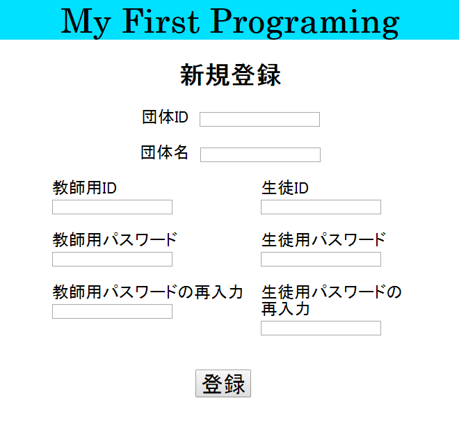

  教師用アカウント、生徒用アカウント共に後で追加することができるが、最初に1つずつ登録する。

  すでに存在する団体IDは登録できない。

  [登録]ボタン押下アカウントが登録され、でログイン画面にもどる。

- 以下の項目を入力し、ログインする。
  - 団体ID
  - ユーザID   ：教師用ID or 生徒用ID
  - パスワード

  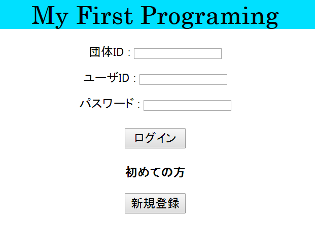

  生徒用でログインする場合、生徒用ログイン画面に推移し、番号を入れることでログインする。
  - 番号  ：半角英数字で任意の文字列を入力
  例：PCに割り振られている番号`PC10`など

  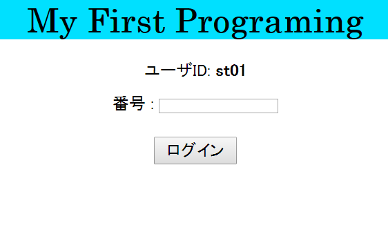

  ログインすることで、メイン画面へ推移する。

  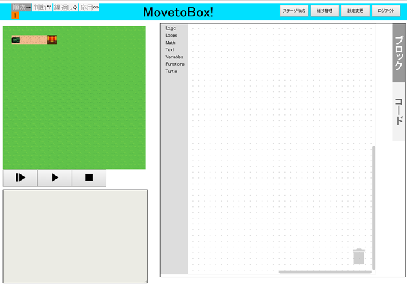

- はじめは問題がないので、ステージ作成をする

  1. 教師用アカウントでログインする

  - 右上の[ステージ作成]ボタンを押下すると、マップ作成画面に推移する。

  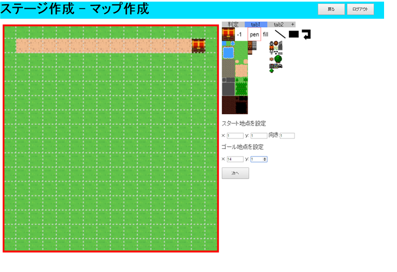

  - マップを作成する
    1. はじめに、[tab1],[tab2]タブでタイルを設置していき、見た目を決める。
    - 次に、[判定]タブを選択し、当たり判定を設定する。
    - 次にスタート地点を決定する。
      - X・Y：スタート地点の座標<br>
        左上が(0,0)、右下が(15,15)
      - 向き : スタート時のプレイヤーの向き<br>
        0:上, 1:右, 2:下, 3:左
    - ゴール地点を設定する。
    - できたら、[次へ]ボタンを押下する。

  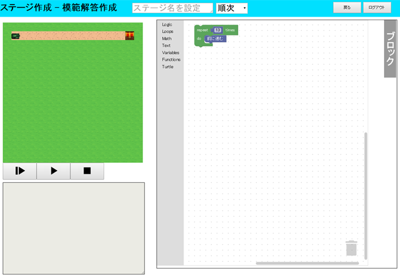

  - 模範解答を作成する
    1. 上のテキストボックスにステージ名を入力
      - 全角文字10文字以上は入力できない
    - ステージの区分を選択する
      - 順次・判断・繰返し・応用　から選択
    - 模範解答を作成
      - ゴールにたどり着かないと作成完了しない
    - ゴールすると、確認アラートが表示される。
    - よければOKを選択する。
    - 登録が完了すると、メイン画面に戻る。

  - 実際に授業などで使用する前に、順次・判断・繰返し・応用それぞれ1つ以上ずつステージを作成する。

#### 授業での使用手順
1. 生徒が使うPCを生徒用ログイン画面が開いているよう設定する。
  - 団体ID,パスワードなど、生徒に必要ない情報を公開しないため

- 教師は教師用アカウントでログインする。

- 生徒はあらかじめ指示された番号を入力し、ログインする。

- 教師はメイン画面右上の[進捗管理]ボタンを押下し、進捗管理画面を開く。

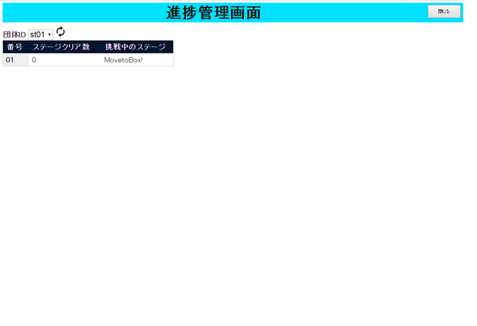

- 進捗管理画面で使用する生徒IDを指定する。

- ログインしている生徒のステージクリア数と現在開いているステージを見ることができる
  - 詰まっている人にアドバイスをしやすい。

- 生徒はブロックで問題を解く
  - ブロックが簡単な生徒はコード(JavaScript)を書くこともできる。

  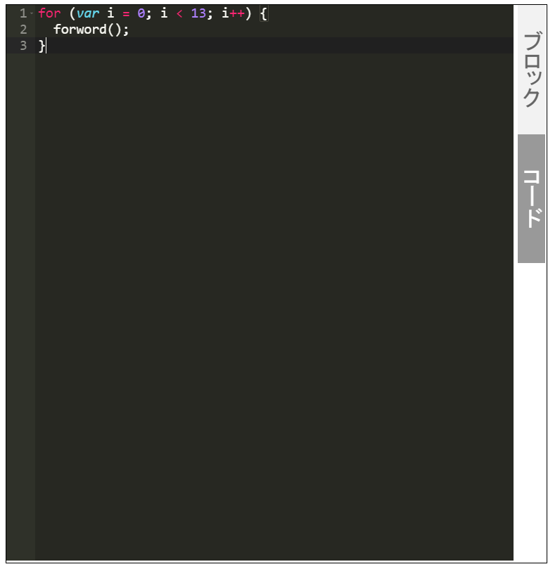

  - 特殊な関数

  ```JavaScript
  //Turtle
  forword(); //前に進む
  back(); //後ろに戻る
  turnRight(); //右を向く
  turnLeft(); //左を向く

  detect(); //前にブロックがあるか(ある場合：true)
  isGoal(); //ゴールにたどりついたか(ゴールにいるなら:true)

  //Text
  print(表示); //左下のテキストエリアに引数を表示する
  ```

#### アカウント、ステージの設定
1. 教師用アカウントでログインし、右上の[設定変更]ボタンを押下

2. 教師用アカウント設定・生徒用アカウント設定・ステージ設定でそれぞれ設定する。

  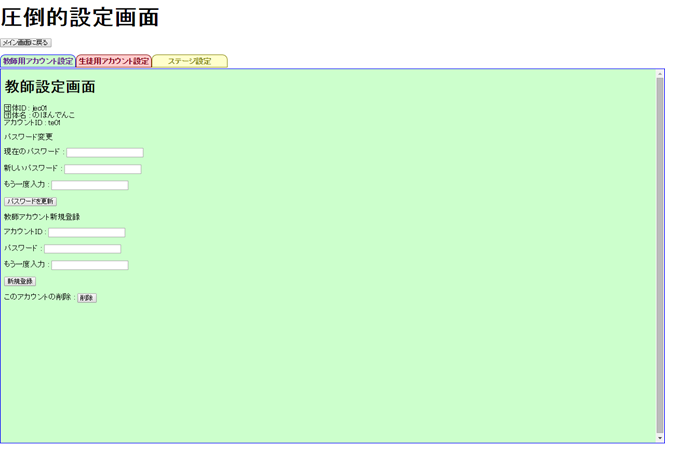
  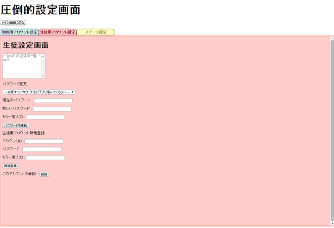
  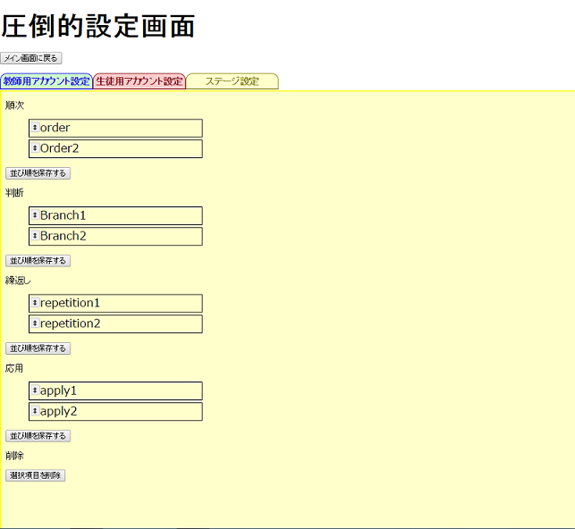

  - アカウントの新規作成・パスワード変更・削除
  - ステージの並び替え・削除
